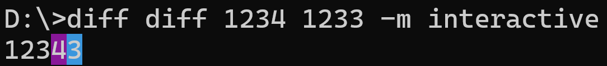

# Diff

A simple command-line tool for computing diffs between strings, files, or program outputs. The diffs are displayed in color to make them easier to read.

---

## Installation

1. Clone the repository:

   ```bash
   git clone https://github.com/Eeeeast/diff
   cd diff
   ```

2. Build the project:

   ```bash
   cargo build --release
   ```

3. Run the binary:

   ```bash
   ./target/release/diff --help
   ```

---

## Usage

### Basic Commands

- **Diff**: Compute the diff between two inputs.
- **Example**: Generate example test cases in YAML format.

Run `diff --help` for detailed options.

---

## Modes

### Interactive Mode

Compare two directly entered strings. The differences are highlighted in color.

```bash
diff diff string1 string2 -m interactive
```

### Batch Mode

Compare the contents of two files. Differences are shown with colored highlights.

```bash
diff diff file1.txt file2.txt -m batch
```

### Program Mode

Run a program with test cases and compare its output. Differences between expected and actual outputs are displayed in color.

```bash
diff diff my_program tests.yaml -m program
```

---

## Generating Test Cases

Generate 3 example test cases in YAML format.

```bash
diff example
```

---

## Example

Compare two strings:

```bash
diff get hello world -m interactive
```



### Notes on Colored Output

- **Deleted Content**: Highlighted in **red**.
- **Inserted Content**: Highlighted in **cyan**.
- **Unchanged Content**: Displayed in the default text color.
